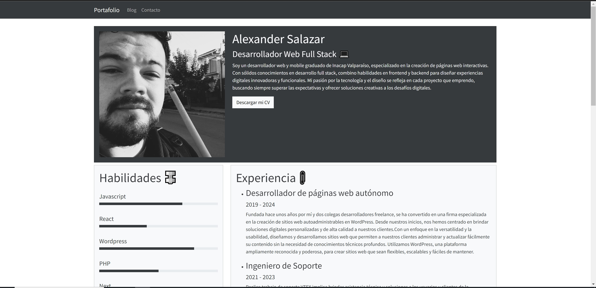

 # Portafolio Alexander Salazar 💻
  El proyecto de portafolio "Alexander Salazar" es una plataforma web desarrollada utilizando Next.js, Bootswatch, JavaScript y React. Este portafolio presenta los proyectos destacados y las habilidades de Alexander Salazar, un desarrollador Full Stack. Con un diseño moderno y atractivo, el portafolio incluye secciones de proyectos, habilidades, experiencia y un formulario de contacto para facilitar la comunicación con potenciales colaboradores o empleadores.

## Tecnologías ⚡
NodeJS - Javascript - Bootswatch - Bootstrap - React - Node

## Capturas de pantalla 📷

## Contacto 
Alexander Salazar - salazaralexander2@gmail.com  📥
